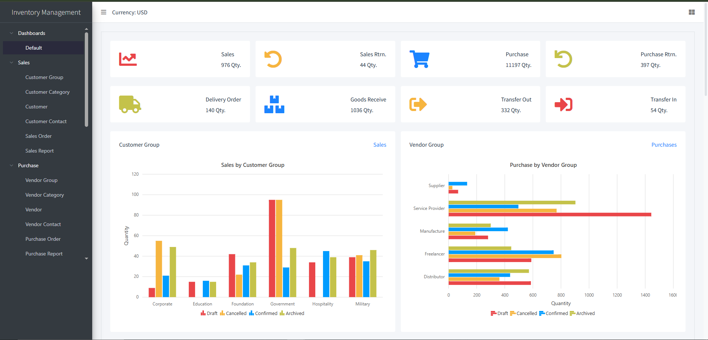

🚀 InventoryManagement
It is a powerful and scalable Warehouse Inventory Management System built with ASP.NET Core 9.0 using a headless API, Clean Architecture, CQRS, and MediatR. It provides seamless integration between the backend and frontend (Razor Pages + Vue.js) for a modern, responsive experience.

🔧 Tech Stack
Backend: ASP.NET Core 9, EF Core, MediatR, AutoMapper, FluentValidation, Serilog, JWT Auth

Frontend: Razor Pages, Vue.js (no build required), Syncfusion UI, AdminLTE, Axios

📦 Key Features
Sales, Purchases, Delivery, Returns

Transfers, Adjustments, Scrapping

Stock Count & Advanced Reporting

User Management, Roles, Logging, and System Settings

▶️ Getting Started
Open in Visual Studio

Set your connection string in appsettings.json

Clean, Build, and Run

💡 The DB auto-creates if not present.

⭐ Support
If you find this useful, please star the repo to support continued development.
